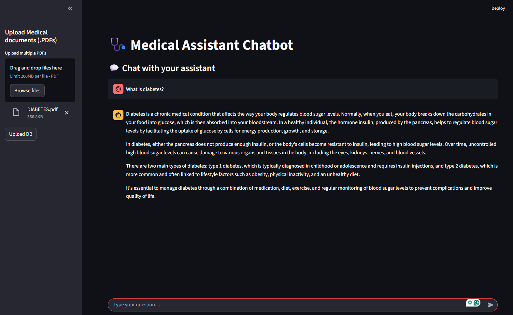

# Medical AI System Architecture Summary



## 📋 Table of Contents

1. [System Components & Workflow](#1-system-components--workflow)
2. [Core Tech Stack](#2-core-tech-stack)
3. [Key Processes](#3-key-processes)
4. [Project Setup Commands](#4-project-setup-commands)
5. [Prerequisites](#5-prerequisites)
6. [Environment Configuration](#6-environment-configuration)
7. [API Keys Setup](#7-api-keys-setup)
8. [Testing the System](#8-testing-the-system)
9. [Project Structure](#9-project-structure)
10. [Troubleshooting](#10-troubleshooting)
11. [Additional Resources](#11-additional-resources)

## 1. System Components & Workflow

### Core System: Medical AI System  

Acts as the central hub integrating all modules.  

### 1.1 Data Ingestion & Preprocessing  

- **PDF Upload**  
  - Uses a PDF Loader for raw text extraction from uploaded PDFs.  
- **Text Chunking**  
  - Employs `RecursiveCharacterTextSplitter` to split text into manageable chunks while maintaining context.  

### 1.2 Embedding & Vectorization  

- **Embedding**  
  - Leverages Google Embedding Model or HuggingFace for converting text chunks into embeddings.  
- **Vector Store**  
  - Stores embeddings in Pinecone Vector Database for efficient similarity-based retrieval.  

### 1.3 Query Handling  

- **Query Processing**  
  - Performs query embedding and similarity search against the vector store to fetch relevant context.  

### 1.4 Response Generation  

- **RAG Chain**  
  - Combines retrieved context with LLM (LLaMA 3 via Groq) using LangChain, guided by a custom system prompt.  
- **Answer Generation**  
  - Produces grounded, human-readable responses using the augmented context.  

### 1.5 Backend & Endpoints (FastAPI Backend)  

- Exposes two key endpoints:  
  - `/upload_pdfs`: For PDF ingestion.  
  - `/ask`: To submit queries and get AI-generated responses.  

## 2. Core Tech Stack  

| Layer          | Tool/Framework                          |  
|----------------|-----------------------------------------|  
| LLM            | Groq (LLaMA 3 70B)                      |  
| Embeddings     | Google Generative AI or HuggingFace (HF) |  
| Vector Store   | Pinecone                                |  
| RAG Chain      | LangChain                               |  
| Backend API    | FastAPI                                 |  
| Deployment     | Render                                  |  

## 3. Key Processes  

1. **PDF → Text → Chunks**: Ingest medical documents, extract text, and split into context-aware chunks.  
2. **Embedding + Vector Storage**: Convert chunks to embeddings, store in Pinecone for fast retrieval.  
3. **Query → Context → Response**: Embed user queries, find matching context in the vector store, and use LLM (via RAG) to generate informed answers.  

This architecture combines RAG (Retrieval-Augmented Generation) with scalable tools to build a medical AI system that delivers accurate, document-grounded responses.

## 4. Project Setup commands

```bash
uv init .
uv venv
source .venv/Scripts/activate

# backend
cd server
uv pip install -r requirements.txt
uvicorn main:app --reload

# frontend
cd client
uv pip install -r requirements.txt
streamlit run app.py
```

## 5. Prerequisites

Before setting up the project, ensure you have:

- **Python 3.8+** installed
- **uv** package manager ([Installation Guide](https://github.com/astral-sh/uv))
- **Git** for version control
- **API Keys** for the following services:
  - Google AI Studio (for embeddings)
  - Groq (for LLM)
  - Pinecone (for vector storage)

## 6. Environment Configuration

Create `.env` files in both server and client directories:

### Server `.env`

```properties
GOOGLE_API_KEY=your_google_api_key_here
GROQ_API_KEY=your_groq_api_key_here
PINECONE_API_KEY=your_pinecone_api_key_here
PINECONE_INDEX_NAME=medical-index
```

### Client `config.py`

```python
API_URL = "http://localhost:8000"  # Backend server URL
```

## 7. API Keys Setup

### 7.1 Google AI Studio API Key

1. Visit [Google AI Studio](https://aistudio.google.com/)
2. Sign in with your Google account
3. Create a new API key
4. Copy the key to your `.env` file

### 7.2 Groq API Key

1. Visit [Groq Console](https://console.groq.com/)
2. Sign up/login
3. Go to API Keys section
4. Create a new API key
5. Copy the key to your `.env` file

### 7.3 Pinecone API Key

1. Visit [Pinecone](https://www.pinecone.io/)
2. Sign up for an account
3. Create a new project
4. Get your API key from the console
5. Copy the key to your `.env` file

## 8. Testing the System

### 8.1 Backend Testing

```bash
# Test server is running
curl http://localhost:8000/docs

# Test PDF upload
curl -X POST "http://localhost:8000/upload_pdfs/" \
  -F "files=@sample_medical_doc.pdf"

# Test question asking
curl -X POST "http://localhost:8000/ask/" \
  -d "question=What are the symptoms of diabetes?"
```

### 8.2 Frontend Testing

1. Open `http://localhost:8501` in your browser
2. Upload a sample medical PDF
3. Ask test questions like:
   - "What are the main symptoms described?"
   - "What treatments are mentioned?"

## 9. Project Structure

```
Medical-AI-Assistant/
├── README.md              # This file
├── outcomes.png           # Demo screenshot
├── server/                # FastAPI backend
│   ├── main.py           # FastAPI app entry point
│   ├── requirements.txt  # Backend dependencies
│   ├── .env             # Environment variables
│   ├── modules/         # Core modules
│   ├── routes/          # API endpoints
│   └── README.md        # Backend documentation
├── client/               # Streamlit frontend
│   ├── app.py           # Streamlit app
│   ├── requirements.txt # Frontend dependencies
│   ├── config.py        # Client configuration
│   ├── utils/           # Utility functions
│   └── README.md        # Frontend documentation
└── docs/                # Additional documentation
```

## 10. Troubleshooting

### Common Issues

#### 10.1 Backend Won't Start

- **Issue**: `uvicorn main:app --reload` fails
- **Solutions**:
  - Check if all dependencies are installed
  - Verify API keys in `.env` file
  - Ensure Pinecone index exists

#### 10.2 Frontend Can't Connect

- **Issue**: Streamlit shows connection errors
- **Solutions**:
  - Verify backend is running on port 8000
  - Check `config.py` API_URL setting
  - Ensure no firewall blocking connections

#### 10.3 PDF Upload Fails

- **Issue**: 422 Unprocessable Entity
- **Solutions**:
  - Check file format (only PDF supported)
  - Verify file size (< 10MB recommended)
  - Ensure proper form data format

#### 10.4 No Response to Questions

- **Issue**: Empty or error responses
- **Solutions**:
  - Upload documents first
  - Check API keys are valid
  - Verify Pinecone index has data

## 11. Additional Resources

### Documentation

- **Server README**: `./server/README.md` - Detailed backend setup
- **Client README**: `./client/README.md` - Frontend usage guide
- **API Documentation**: `http://localhost:8000/docs` (when server is running)

### External Resources

- [LangChain Documentation](https://docs.langchain.com/)
- [Pinecone Documentation](https://docs.pinecone.io/)
- [Groq Documentation](https://console.groq.com/docs)
- [Google AI Studio](https://aistudio.google.com/)
- [Streamlit Documentation](https://docs.streamlit.io/)

### Performance Tips

- Use smaller PDF files (< 5MB) for faster processing
- Optimize chunk sizes based on your document types
- Consider implementing caching for repeated queries
- Monitor API usage to avoid rate limits

---

**Note**: This is a development setup. For production deployment, additional considerations for security, scalability, and monitoring are required.

## 12. Other Details

Please refer to the detailed README files in the Server and Client directories for comprehensive setup and usage instructions.
